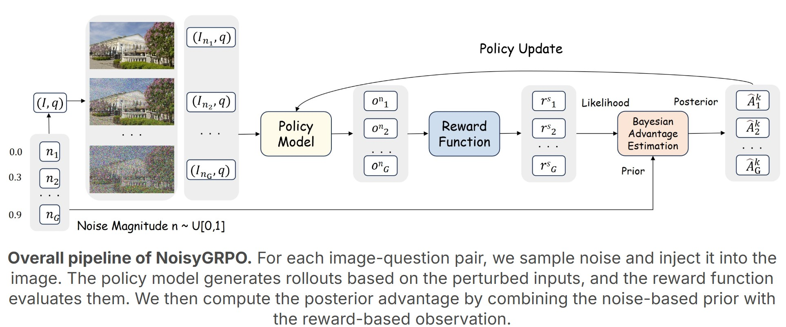

<div align="center">
  <h2>NoisyGRPO: Incentivizing Multimodal CoT Reasoning via Noise Injection and Bayesian Estimatio

  (NeurIPs 2025)
  </h2>
   
</div>

<br></br>
<p align="center">
  

</p> 

This repository contains the reference code for the paper [NoisyGRPO: Incentivizing Multimodal CoT Reasoning via Noise Injection and Bayesian Estimatio](https://arxiv.org/abs/2510.21122).

[🎯 Project web page](https://artanic30.github.io/project_pages/NoisyGRPO/) |
[Paper](https://arxiv.org/pdf/2510.21122) |

[//]: # ([🤗 HuggingFace Model]&#40;https://huggingface.co/aimagelab/ReflectiVA&#41; |)

[//]: # ([🤗 HuggingFace Dataset]&#40;https://huggingface.co/datasets/aimagelab/ReflectiVA-Data&#41; |)

## Table of Contents

0. [ToDo](#ToDo)
1. [Citation](#citation)
2. [Overview](#overview)
3. [Installation](#installation)
4. [Model](#model)
5. [Dataset](#dataset)
6. [Training](#training)
8. [Inference](#inference)
9. [Acknowledgements](#acknowledgements)


## ToDo

- [ ] Release the Training Code.
- [ ] Release the Training Data.
- [ ] Release the Models Weights.
- [ ] Release the Training Scripts.
- [ ] Release the Evaluation Code.


## Citation

Please cite this work with the following BibTeX:
```
@article{qiu2025noisygrpo,
  title={NoisyGRPO: Incentivizing Multimodal CoT Reasoning via Noise Injection and Bayesian Estimation},
  author={Qiu, Longtian and Ning, Shan and Sun, Jiaxuan and He, Xuming},
  journal={arXiv preprint arXiv:2510.21122},
  year={2025},
}
```

## Overview
Reinforcement learning (RL) has shown promise in enhancing the general Chain-of-Thought (CoT) reasoning capabilities of multimodal large language models (MLLMs). However, when applied to improve general CoT reasoning, existing RL frameworks often struggle to generalize beyond the training distribution. To address this, we propose NoisyGRPO, a systematic multimodal RL framework that introduces controllable noise into visual inputs for enhanced exploration and explicitly models the advantage estimation process via a Bayesian framework. Specifically, NoisyGRPO improves RL training by: (1) Noise-Injected Exploration Policy: Perturbing visual inputs with Gaussian noise to encourage exploration across a wider range of visual scenarios; and (2) Bayesian Advantage Estimation: Formulating advantage estimation as a principled Bayesian inference problem, where the injected noise level serves as a prior and the observed trajectory reward as the likelihood. This Bayesian modeling fuses both sources of information to compute a robust posterior estimate of trajectory advantage, effectively guiding MLLMs to prefer visually grounded trajectories over noisy ones. 
## Installation
To create the conda environment named reflectiva use the following instructions.
With this environment you have all the packages to run the code inside this repo. 
```
conda create -n noisygrpo python=3.10
conda activate noisygrpo
bash setup.sh
```

[//]: # (## Model)

[//]: # (You can access the official model weights for the [ReflectiVA model]&#40;https://huggingface.co/aimagelab/ReflectiVA&#41; on 🤗 Hugging Face.)

[//]: # ()
[//]: # (## Dataset)

[//]: # (The official [training dataset]&#40;https://huggingface.co/datasets/aimagelab/ReflectiVA-Data&#41; can be accessed on 🤗 Hugging Face.)

[//]: # (```)

[//]: # (cd <data_local_path>)

[//]: # (!pip install huggingface_hub)

[//]: # ()
[//]: # (python -c "from huggingface_hub import snapshot_download; snapshot_download&#40;repo_id="aimagelab/ReflectiVA-Data", repo_type="dataset", local_dir="<data_local_path>"&#41;")

[//]: # (```)

[//]: # (Please note that the JSON file includes only the relative paths to the images. To access the actual images, you’ll need to download them from their original sources: [infoseek]&#40;https://github.com/open-vision-language/infoseek?tab=readme-ov-file#infoseek-images&#41;, [encycopedic]&#40;https://github.com/google-research/google-research/tree/master/encyclopedic_vqa&#41; and [llava]&#40;https://github.com/haotian-liu/LLaVA?tab=readme-ov-file#visual-instruction-tuning&#41;.  )

[//]: # (## Training)

[//]: # ()
[//]: # ()
[//]: # (Before starting the training of `ReflectiVA`, make sure to set up the environment and download the dataset to your local machine. Additionally, update the absolute paths in the functions starting with `fill_abs_path` to correctly point to the image locations in your configuration.)

[//]: # ()
[//]: # (Once everything is set up, you can launch the training job using the following command:)

[//]: # ()
[//]: # ()
[//]: # (```)

[//]: # ()
[//]: # (cd ./ReflectivA)

[//]: # ()
[//]: # (bash scripts/train_reflectiva.sh)

[//]: # ()
[//]: # (```)

[//]: # (## Inference)

[//]: # (Before running the inference, unzip the data and modify the paths in the `.sh` files to align with your local cluster setup and the files downloaded in the previous step.)

[//]: # ()
[//]: # (Inference code for Infoseek:)

[//]: # (```bash)

[//]: # (sbatch scripts/ReflectiVA_infoseek.sh)

[//]: # (```)

[//]: # ()
[//]: # (Inference code for Encyclopedic-VQA:)

[//]: # (```bash)

[//]: # (sbatch scripts/ReflectiVA_evqa.sh)

[//]: # (```)

## Acknowledgements
We would like to express our sincere gratitude to [DeepSeek](https://github.com/deepseek-ai/DeepSeek-R1), [Open-R1](https://github.com/huggingface/open-r1), [QwenVL](https://github.com/QwenLM/Qwen2.5-VL), [Open-R1-Multimodal](https://github.com/EvolvingLMMs-Lab/open-r1-multimodal) and [VLM-R1](https://github.com/om-ai-lab/VLM-R1)  for providing open-source resources that contributed to the development of this project.
